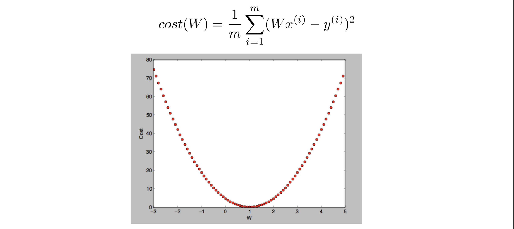
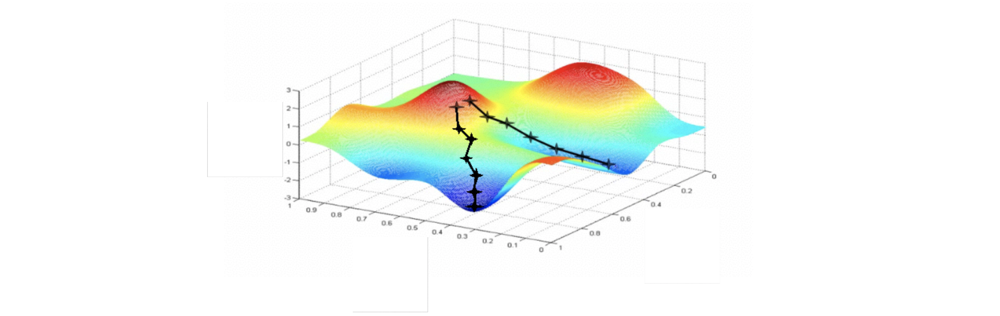
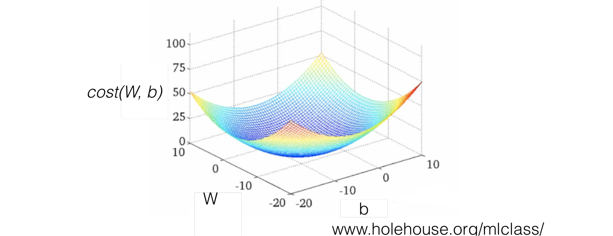

# How to minimize cost

[수식 보는 방법](<https://chrome.google.com/webstore/detail/mathjax-plugin-for-github/ioemnmodlmafdkllaclgeombjnmnbima/related?hl=en>)
$$
cost(W, b) = \frac{1}{m}\sum_{i=1}^m (H(x^{(i)})-y^{(i)})^2
$$

$$
\underset{cost}{minimize}(W, b)
$$

지난 시간에는 cost를 최소화 하는 W,b 값을 찾아야 함을 배웠다면, 이번에는 어떻게 최솟값을 찾아내는 지에 관하여 배워보자.

cost 함수는, 그래프 그려보면 이와 같다. 여기서는 cost를 최소화 시키는 w=1일 때 인데, 컴퓨터가 이를 찾게 하려면 어떡해야할까?

 

## Gradient descent algorithm

이 알고리즘을 활용하면 가능하다! 간략히 설명해보면, 함수의 **경사도**에 따라, W값을 + or - 시켜가며, cost를 가장 낮출 수 있는 W값을 찾아나간다는 것이다. 위의 그래프에서, W=3인 지점에 있다고 생각해보면 경사도는 +가 나올 것이다. 그러니, cost가 적은 쪽으로 가기 위해서는, W를 좀 더 줄여야한다. 이런 느낌의 판단을 가능하게 하는 것이 바로 Gradient descent algorithm.

우리가 배웠던 linear regression 모델에서의 공식을 미분해보면, 아래처럼 표현할 수 있다. 
$$
W := W - \alpha\frac{1}{m}\sum_{i=1}^m (H(x^{(i)})-y^{(i)})x^{(i)}
$$
(참고로, := 기호는 lhs가 rhs에 의하여 정의 된다는 것.)

여기서 알파 값은 상수이고, **learning rate**로, 우리는 이 값을 조정하여 W의 이동정도를 다르게 할 수 있다.

 

## Convex function

Convex function… 어려운 거 아니당. 그냥 볼록함수라는 의미 ㅎㅎ

Gradient descent algorithm은 그리디 방식으로 순간 순간 최적의 선택을 한다. 즉, 더 낮아보이는 경사로 전체 그래프를 고려한 것이 아닌, 그 순간의 판단으로 내려간다. 그리디 방식을 채택하기 위해서는 이 순간의 선택이 전체에서도 최적의 선택을 만들어 줄 수 있다는 것을 증명해야 한다. 그렇기 때문에, 고려해야 하는 것이 convex function 여부. 

그리고, 아래 그래프는 Gradient descent algorithm가 적용될 수 없는 경우.

아래처럼 볼록/오목하게, 나와야 한다. 아래 그래프는 우리가 배웠던 선형 회귀에서의 cost 그래프. 그러니 우리는 안심하고 선형 회귀에서 알맞은 W, b 값을 찾기 위하여, Gradient descent algorithm 방식을 채택해도 된다!

