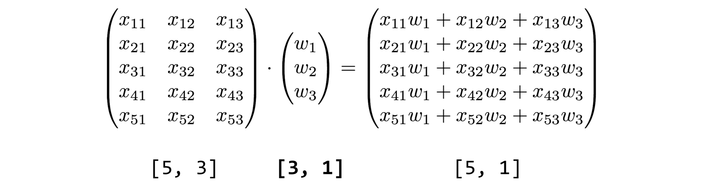

# Multivariable linear regression

 

이전에 본 시험들의 결과로, 앞으로 볼 시험 점수를 예측하는 프로그램을 만든다고 생각해봅시당. 이는, linear regression으로 표현 가능할텐데, 다만, w의 변수가 여러개가 될 것 입니다.
$$
H (x) = w_1x_1 + w_2x_2 + ... + w_nx_n + b
$$
얘네는 그럼 어떻게 계산할까요? Matrix 간의 곱셈으로 해결 가능합니다. 만약, 3개의 변수에 대한 5가지 traing set이 있다면, 아래처럼 계산할 수 있겠죠.

수식으로 표현하면 아래와 같습니다.
$$
H(X) = WX
$$
