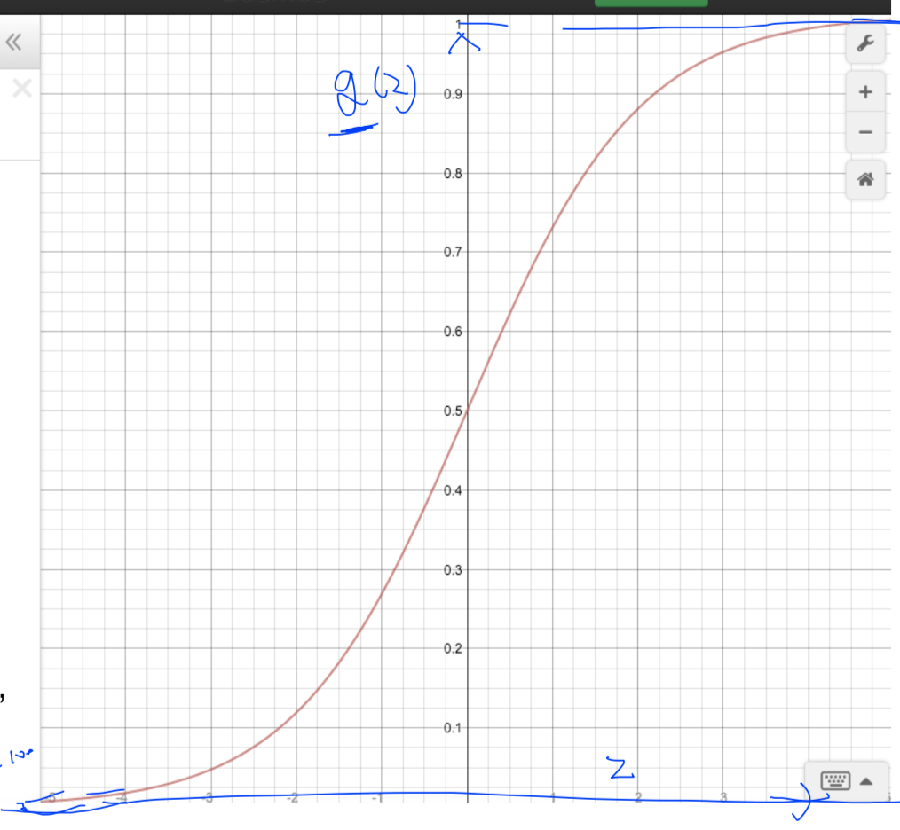
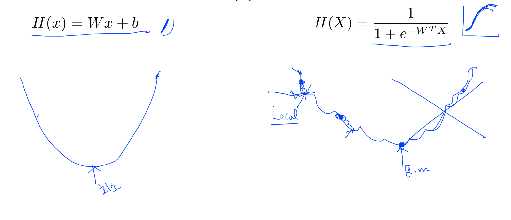
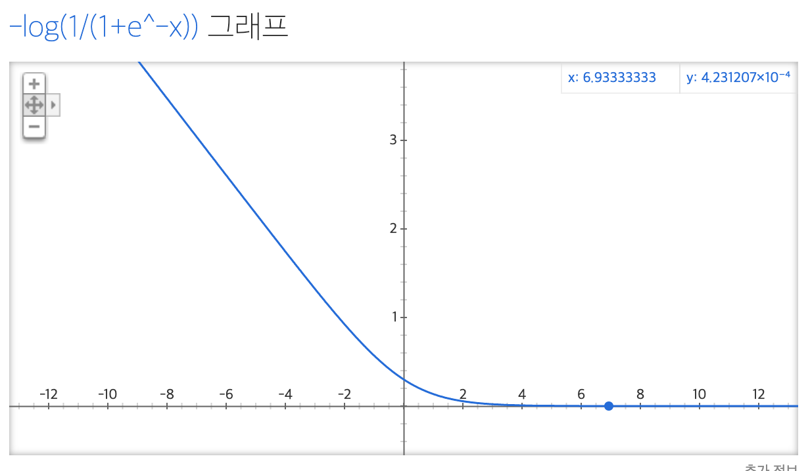
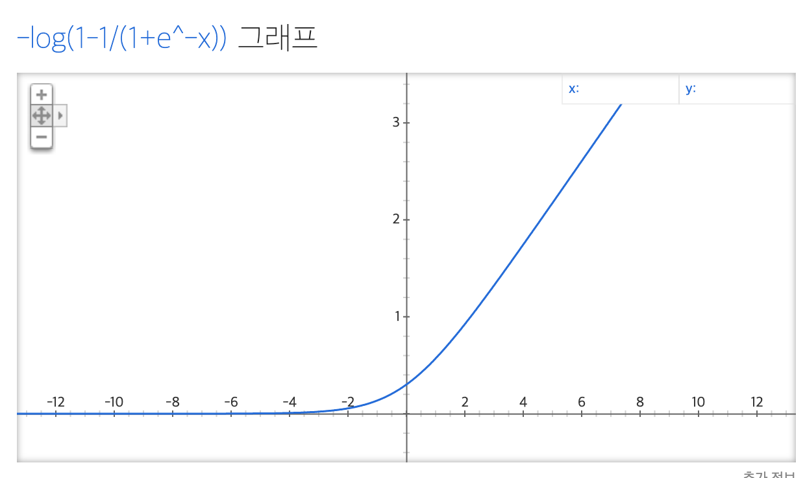

# Logistic (regression) classification

 

## Hypothesis

여태까지는 Linear Regression에 관하여 배웠습니다. 그렇다면, Binary Classification에서는 어떻게 Hypothesis, Cost, Gradient Decent를 세워야 할까요? 

Binary Classification는 다양한 곳에서 쓰입니다. 예를 들면, 스팸 메일 구분, 페이스북 피드가 친구 게시글을 보여줄지/말지 선정할 때, 신용 카드 사용자의 패턴이 기존과 같은 지/다른 지 등등… 

Hypothesis에서, 즉, H(X) = Y에서 Y는 항상 0 아니면 1로 나올 것입니다. 이것은 기존의 linear regression의 hypothesis를 적용하기에는 조금 어색한 부분이 있죠. W값을 어떻게 줄 것이며, 0과 1을 구분짓는 y값 기준은 어떡할 건지…

그래서 똑똑하신 분들은 새로운 모델을 찾아냈습니다. 바로, sigmoid 함수. 
$$
H(x) = g(z) = \frac{1}{1 + e^{-z}}
$$
linear hypothesis를 z에 적용하여, z = wx라고 한다면
$$
H(x) = \frac{1}{1 + e^{-w^tx}}
$$
얘의 그래프는 우리가 바라던 것과 같이, 0과 1로 사이의 값만을 지닐 수 있습니다.

 

## Cost, Gradient Decent

$$
cost(W) = \frac{1}{m}\sum_{i=1}^m (H(x^{(i)})-y^{(i)})^2
$$

바뀐 H(x)에서도, 비용이 가장 적은 cost를 만족 시키는 W를 찾아야 한다. 하지만 기존의 linear regression의 H(x)는 직선형이지만, logistic classification에서는 곡선인 sigmoid 형태이므로, 기존처럼 볼록한 모양이 아니라, 울퉁불퉁 볼록한 그래프가 그려진다. 그래서, gradient decent를 적용할 수 없다. local minimum들이 생겨나고, 이게 global minimum인지는 모르니까…

$$
Cost(W)= \frac{1}{m} \sum c(H(x),y) \text{ 일 때,}\\

c(H(x), y) = 
\begin{cases}
-log(H(x)), & \text{if y = 1}\\
-log(1-H(x)), & \text{if y = 0}
\end{cases}
$$
그래서 나온 게 위처럼 log로 바꾸는 것. 몇가지 예제를 넣어 보면, 저 log가 어떤 타당성을 지니는 지 알 수 있다. (H(x), y)가 각각 (0, 0), (1, 0), (0, 1), (1, 1)일 때, cost는 0, 1, 1, 0으로 나와야 한다는 것을 이해하고, 그래프를 보면 된다. 

근데, if 구문 일일이 적는건 너무 귀찮으니까, 아래 처럼 표현할 수 있다.
$$
Cost(H(x), y) = - y\text{ }log(H(x)) - (1 - y)\text{ }log(1 - H(x))
$$
결론적으로, gradient decent를 적용할 수 있는 그래프의 cost함수를 그릴 수 있게 되었다. cost 함수를 미분해보면, convex 조건을 만족시키리라 추측할 수 있다.

